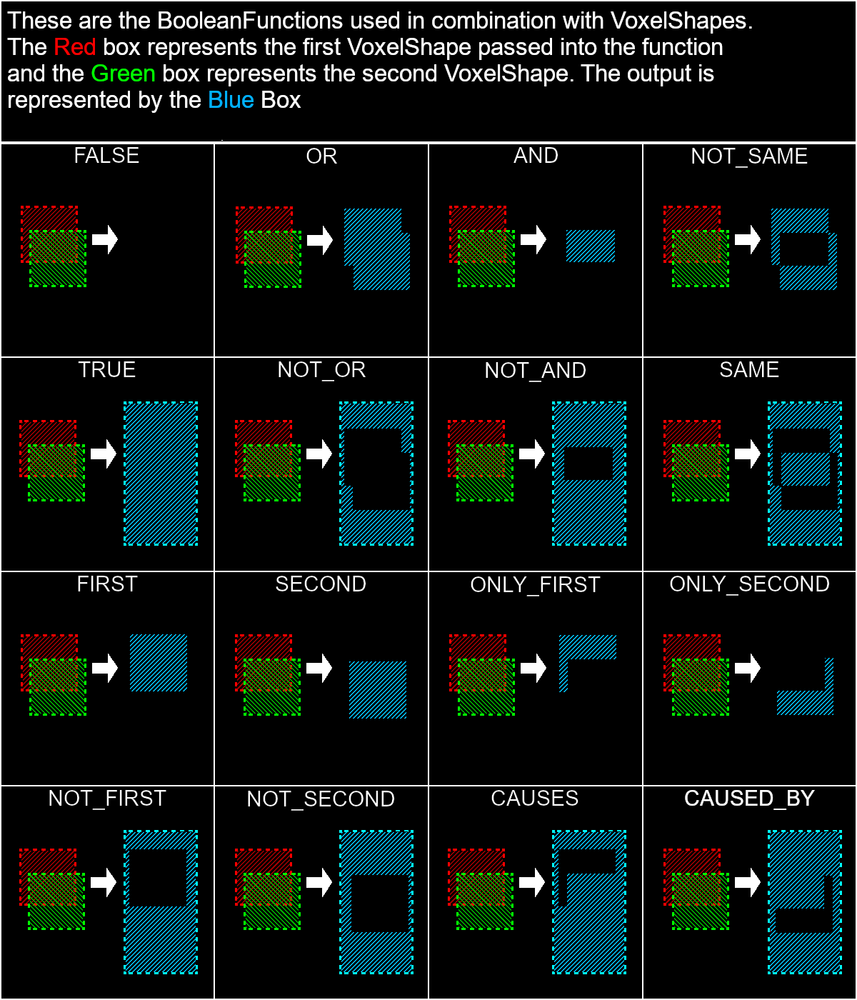

TODO

```json
{
  "shapes": [
    {
      "when": {
        "facing": "east"
      },
      "shape": [ 2, 2, 2, 14, 14, 14 ]
    },
    [ 0, 0, 0, 16, 2, 16 ],
    [ 5, 2, 0, 11, 16, 11 ]
  ]
}
```

## Basic Shape

Basic shapes can be defined in 2 ways:

* As a json object (`{}`) with the properties `x1`, `y1`, `z1`, `x2`, `y2`, and `z2`, corresponding to the 2 corners of the axis-aligned box.
* As a json array (`[]`), with 6 numbers corresponding to the values in the same order: `[x1, y1, z1, x2, y2, z2]`. 

## Compound Shape

Like basic shapes, compound shapes can be defined in 2 ways:

* As a json object (`{}`) with two fields, "op" and "shapes"
    ```json
      {
        "op": "OR",
        "shapes": []
      } 
    ```
  * `"op"`: Optional. Default: OR. A boolean operation name to be used when combining successive shapes. The operation is applied left to right.
    * "false": All shapes are ignored. The result is an empty shape.
    * "not_or": The result includes only the parts that are outside **all** the child shapes.
      * Equivalent to the inverse of the union shape in CSG.
    * "only_second": The result includes all areas present in the second shape, that are not present in the first shape.
    * "not_first": The result ignores all but the first shape, and returns the inverse of the first shape.
    * "only_first": The result includes all areas present in the first shape, that are not present in the second shape.
    * "not_second": The result ignores all but the last shape, and returns the inverse of the last shape.
    * "not_same": The result includes all areas that are present in one shape or the other, but not both.
      * Equivalent to the difference shape in CSG.
    * "not_and": The result includes all areas that are outside **any** of the child shapes.
      * Equivalent to the inverse of the intersection shape in CSG.
    * "and": The result includes only the areas that are present in **all** of the child shapes.
      * Equivalent to the intersection shape in CSG.
    * "same": The result includes all areas that are either outside all shapes, or inside all shapes.
      * Equivalent to the inverse of the difference shape.
    * "second": The result ignores all but the last shape.
    * "causes": The result includes the areas outside the first shape, combined with the areas inside the second shape.
    * "first": The result ignores all but the first shape.
    * "caused_by": The result includes the areas inside the first shape, combined with the areas outside the second shape.
    * "or": The result contains all areas present in **any** shape.
      * Equivalent to the union shape in CSG.
    * "true": All shapes are ignored. The result is a full box shape.
  * `"shapes"`: Required. A json array (`[]`) containing the child shapes to combine.
* As a json array (`[]`), with 6 numbers corresponding to the values in the same order: `[x1, y1, z1, x2, y2, z2]`.

### Helpful image



## Conditional Shape

Conditional shapes consist of a json object (`{}`) containing 2 fields:

* `"when"`: A set of conditions to be applied to the block state using the shape.
* `"shape"`: A single shape to return when the condition is true.

The condition is a json object (`{}`) containing one key per property to match. The value of that property can either be a single string, or a list of strings, corresponding to a set of alternative values for each property.
